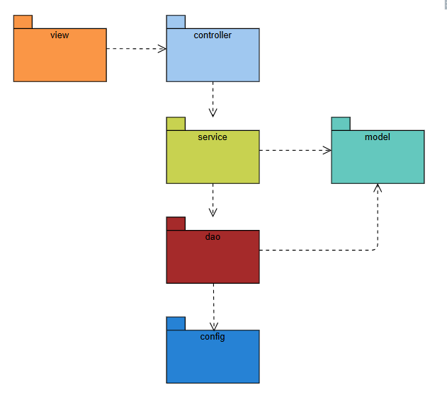

# DTI Case Tecnico - Sistema de Gerenciamento de Jogos

Este projeto é uma solução para o desafio técnico da dti digital, consistindo em um sistema CRUD completo para cadastro, consulta, atualização e remoção de jogos, com persistência em banco 🗄️ SQLite, arquitetura MVC, testes unitários e pronto para execução via 🐳 Docker.

---

## 📑 Sumário
- [Recurso Principal: Jogo](#recurso-principal-jogo)
- [Linguagem Escolhida](#linguagem-escolhida)
- [Arquitetura e Tecnologias](#arquitetura-e-tecnologias)
- [Instalacao e Dependencias](#instalacao-e-dependencias)
- [Execucao da Aplicacao com Docker](#-execucao-da-aplicacao-com-docker)
- [Execucao da Aplicacao com Maven (Desenvolvimento)](#-execucao-da-aplicacao-com-maven-desenvolvimento)
- [Execucao da Aplicacao JAR Standalone](#-execucao-da-aplicacao-jar-standalone)
- [Como Usar Cada Funcionalidade (Passo a Passo)](#como-usar-cada-funcionalidade-passo-a-passo)
- [Exemplo de Arquivo de Log](#exemplo-de-arquivo-de-log)
- [Queries SQL Utilizadas](#queries-sql-utilizadas)
- [Possiveis Melhorias Futuras](#possiveis-melhorias-futuras)
- [Contato](#contato)

---

## Recurso Principal: Jogo

A aplicação gerencia o recurso **Jogo**, que possui as seguintes propriedades:

| 📄 Campo           | Obrigatório | Tipo de Dado | Descrição                                 |
|--------------------|-------------|--------------|--------------------------------------------|
| 🆔 id              | Sim         | Inteiro      | Identificador único (gerado automaticamente)|
| 🏷️ titulo          | Sim         | String       | Título do jogo                             |
| 🏷️ genero          | Sim         | String       | Gênero do jogo                             |
| 📅 dataLancamento  | Sim         | Data         | Data de lançamento (formato dd/MM/yyyy)    |
| ⭐ notaPessoal     | Não         | Double       | Nota pessoal atribuída ao jogo (0 a 10)    |

- **Obrigatórios:** `id`, `titulo`, `genero`, `dataLancamento`
- **Opcionais:** `notaPessoal`

⚠️ Validações são aplicadas para garantir que os campos obrigatórios sejam preenchidos e que a nota pessoal, se informada, esteja entre 0 e 10.

---

## Linguagem Escolhida
- **Java 21**

---

## Arquitetura e Tecnologias
- ☕ **Java 21**
- 📦 **Maven** (gerenciamento de dependências)
- 🧪 **JUnit 5** (testes unitários)
- 🕵️‍♂️ **Mockito** (mocks para testes)
- 🗄️ **SQLite** (banco de dados embarcado)
- 📝 **SLF4J** (logs)
- 🐳 **Docker** (containerização)

### 📂 Estrutura do Projeto
```
src/
  main/
    java/
      org/app/
        config/      # Configuração do banco SQLite
        controller/  # Orquestração (JogoController)
        dao/         # Acesso a dados (JogoDAO)
        model/       # Entidade Jogo
        service/     # Regras de negócio (JogoService)
        view/        # Interface de console (JogoView)
        Main.java    # Classe principal
  test/
    java/org/app/service/JogoServiceTest.java
Dockerfile
pom.xml
README.md
```

### 🗺️ Diagrama de Pacotes



---

## Instalacao e Dependencias

### 1. Dependências
- ☕ **Java 21**: [Download](https://www.oracle.com/br/java/technologies/downloads/#java21)
- 📦 **Maven**: [Download](https://maven.apache.org/download.cgi)
- 🐳 **Docker** (opcional, para execução via container): [Download](https://www.docker.com/get-started/)

As dependências do projeto são gerenciadas automaticamente pelo Maven (veja `pom.xml`).

### 2. Instalação
- 📥 Clone o repositório:
  ```sh
  git clone <url-do-repositorio>
  cd DTI_CaseTecnico
  ```

---

## 🐳 Execucao da Aplicacao com Docker
> **Pré-requisito:** Docker instalado

🐳 Execute o comando abaixo para rodar a aplicação em modo interativo no terminal:

```sh
docker run -it --rm ad3ln0r/dti-casetecnico-leandroalencar:1.0
```
🗄️ O banco de dados será criado automaticamente no primeiro uso.

---

## ☕ Execucao da Aplicacao com Maven (Desenvolvimento)
> **Pré-requisitos:** Java 21 e Maven instalados

1. ⚙️ Compile o projeto:
   ```sh
   mvn clean package
   ```
   📦 Isso irá gerar os arquivos JAR na pasta `target/`.
2. 🏃 Execute pelo Maven (recomendado para desenvolvimento):
   ```sh
   mvn exec:java -Dexec.mainClass="org.app.Main"
   ```
   Ou rode diretamente pelo seu IDE (IntelliJ, Eclipse, VSCode, etc).

---

## 📦 Execucao da Aplicacao JAR Standalone
> **Recomendado para rodar fora do Maven/IDE**

Após compilar o projeto com `mvn clean package`, utilize o JAR gerado com todas as dependências:
```sh
java -jar target/CaseTecnico_LeandroAlencar_DTI-1.0-SNAPSHOT-jar-with-dependencies.jar
```
✅ Esse comando garante que todos os drivers e bibliotecas necessários estarão disponíveis, evitando erros como `No suitable driver found for jdbc:sqlite:jogos.db`.

#### ⚠️ Erros comuns
- ❌ Se aparecer o erro `No suitable driver found for jdbc:sqlite:jogos.db`, significa que você está rodando o JAR principal sem dependências. Use o JAR `-jar-with-dependencies.jar`.
- ❌ Se não conseguir deletar a pasta `target`, feche todos os programas que possam estar usando arquivos dela e tente novamente.

---

## Como Usar Cada Funcionalidade (Passo a Passo)

A aplicação é totalmente interativa via console. Veja abaixo como utilizar cada funcionalidade do menu principal, com exemplos e dicas:

### 🏠 Menu Principal
```
=== MENU DE JOGOS ===
1 - ➕ Cadastrar Jogo
2 - 📋 Listar Jogos
3 - 🔍 Buscar Jogo por ID
4 - ✏️ Atualizar Jogo
5 - 🗑️ Deletar Jogo
0 - 🚪 Sair
```

### ➕ 1. Cadastrar Jogo
- Escolha a opção 1 no menu.
- Preencha os campos obrigatórios: **Título**, **Gênero**, **Data de Lançamento** (formato dd/MM/yyyy). O campo **Nota Pessoal** é opcional (0 a 10).
- Exemplo de preenchimento:
```
--- Cadastrar Jogo ---
Título: The Legend of Zelda
Gênero: Aventura
Data de lançamento (dd/MM/yyyy): 21/02/1986
Nota pessoal (0-10, opcional): 9.5
✅ Jogo cadastrado com sucesso!
```
- 💡 **Dica:** Se algum campo obrigatório ficar em branco, a operação será cancelada e uma mensagem de erro será exibida.

### 📋 2. Listar Jogos
- Escolha a opção 2 no menu.
- Todos os jogos cadastrados serão exibidos em formato de lista:
```
--- Lista de Jogos ---
ID: 1 | Título: The Legend of Zelda | Gênero: Aventura | Data de Lançamento: 21/02/1986 | Nota Pessoal: 9.5
```
- 💡 **Dica:** Se não houver jogos cadastrados, a lista estará vazia.

### 🔍 3. Buscar Jogo por ID
- Escolha a opção 3 no menu.
- Informe o **ID** do jogo que deseja consultar.
- Exemplo:
```
ID do jogo: 1
ID: 1 | Título: The Legend of Zelda | Gênero: Aventura | Data de Lançamento: 21/02/1986 | Nota Pessoal: 9.5
```
- ⚠️ **Dica:** Se o ID não existir, será exibida uma mensagem de erro: `❌ Nenhum jogo encontrado com ID X`.

### ✏️ 4. Atualizar Jogo
- Escolha a opção 4 no menu.
- Informe o **ID** do jogo que deseja atualizar.
- Preencha os novos dados para o jogo (os campos seguem as mesmas regras do cadastro).
- Exemplo:
```
--- Atualizar Jogo ---
ID do jogo: 1
Novo título: The Legend of Zelda: Remastered
Novo gênero: Aventura
Nova data de lançamento (dd/MM/yyyy): 21/02/1986
Nova nota pessoal (0-10, opcional): 10
✅ Jogo atualizado com sucesso!
```
- ⚠️ **Dica:** Se o ID informado não existir, será exibida uma mensagem de erro.

### 🗑️ 5. Deletar Jogo
- Escolha a opção 5 no menu.
- Informe o **ID** do jogo que deseja remover.
- Exemplo:
```
ID do jogo: 1
🗑️ Jogo deletado com sucesso!
```
- ⚠️ **Dica:** Se o ID informado não existir, será exibida uma mensagem de erro.

### ⚠️ Validações e Mensagens de Erro
- ❌ **Campos obrigatórios não preenchidos:**
```
Título: 
❌ Campo obrigatório, operação cancelada!
```
- ❌ **Busca por ID inexistente:**
```
ID do jogo: 99
❌ Nenhum jogo encontrado com ID 99
```
- 💡 O sistema sempre orienta o usuário em caso de erro, exibindo mensagens claras e amigáveis.

---

## Exemplo de Arquivo de Log

Ao final da execução, será gerado um arquivo `logs.txt` com o seguinte formato:

```
==== LOGS DA EXECUÇÃO ====
[LOG] Tabela 'jogo' criada ou já existe.
[LOG] Recebida solicitação para cadastrar jogo: sekiro
[LOG] Cadastrando jogo: sekiro
[LOG] Jogo inserido: sekiro
[LOG] Jogo cadastrado com sucesso: sekiro
[LOG] Jogo cadastrado via controller: sekiro
```

---

## Queries SQL Utilizadas

Abaixo estão as principais queries SQL utilizadas pelo sistema para manipulação do banco de dados SQLite:

```sql
-- Criação da tabela
CREATE TABLE IF NOT EXISTS jogo (
    id INTEGER PRIMARY KEY AUTOINCREMENT,
    titulo TEXT NOT NULL,
    genero TEXT NOT NULL,
    data_lancamento TEXT NOT NULL,
    nota_pessoal REAL
);

-- Inserção de novo jogo
INSERT INTO jogo(titulo, genero, data_lancamento, nota_pessoal) VALUES (?, ?, ?, ?);

-- Listar todos os jogos
SELECT * FROM jogo;

-- Buscar jogo por ID
SELECT * FROM jogo WHERE id = ?;

-- Atualizar jogo existente
UPDATE jogo SET titulo=?, genero=?, data_lancamento=?, nota_pessoal=? WHERE id=?;

-- Deletar jogo
DELETE FROM jogo WHERE id=?;
```

---

## Possiveis Melhorias Futuras
- 🖥️ Interface gráfica (GUI) ou API REST
- 🔒 Autenticação de usuário
- 📑 Paginação e filtros na listagem de jogos
- 🧪 Mais testes automatizados (controller, DAO)

---

## Contato
Dúvidas ou sugestões:
- **Leandro Alencar**
- 📧 E-mail: Leandro130333.dev@gmail.com
- 📱 WhatsApp/Telefone: (31) 98347-9067
